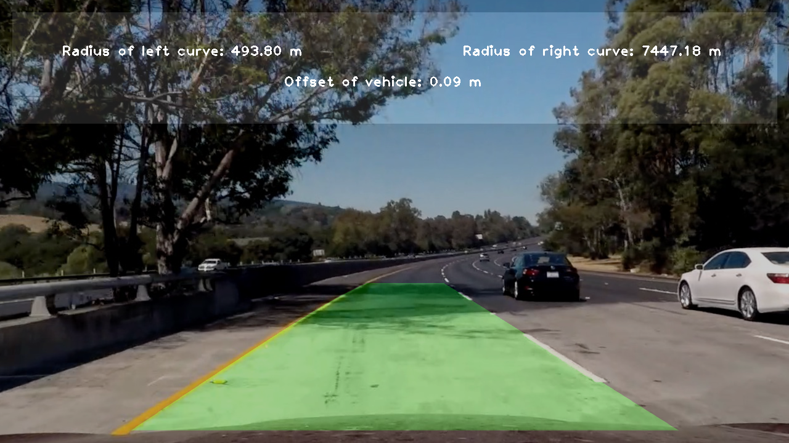

## Advanced Lane Finding

## Steps to run code

1. Clone starter kit repo to setup environment https://github.com/udacity/CarND-Term1-Starter-Kit
2. Follow these directions: https://github.com/udacity/CarND-Term1-Starter-Kit/blob/master/doc/configure_via_anaconda.md
3. Activate the `carnd-term1` environment

You can run the code either with the Jupyter notebook or via the command line

## Jupyter notebook

1. Run `jupyter notebook` from root directory of this repository
2. Open the P2 notebook
3. Run all the code blocks. You can see processed images in the test_images_output directory and you can see the processed videos either embedded in the notebook or in the test_videos_output directory

## Command line

1. Run `python src/main.py` from the root direction of this repository
2. You can see processed images in the test_images_output directory and you can see the processed videos in the test_videos_output directory

## Writeup

The Jupyter notebook I have provided is designed to be an interactive writeup basically but if you prefer to read a markdown file an export is linked: [Advanced Lane Finding Writeup](writeup/writeup.md)